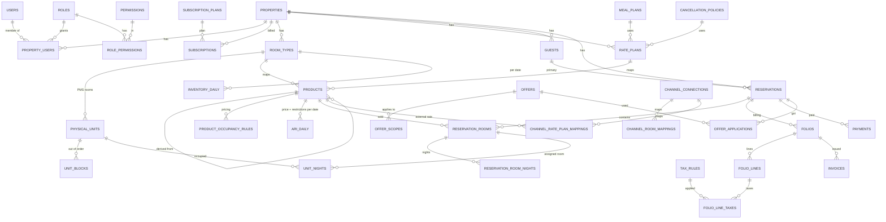

# OzePMS — Database (Phase 0)

The full table specification (columns, types, defaults, keys, indexes, constraints) is
`database/schema/ozepms_schema_v1.sql`. It has been loaded and tested on MySQL 8.
Laravel migrations will be generated from it phase by phase.

## Entity groups

| Group | Tables |
|---|---|
| Reference | currencies, countries, states, languages, property_types, bed_types |
| Platform | users, password_reset_tokens, login_attempts, permissions, roles, role_permissions, platform_user_roles, subscription_plans, subscriptions, audit_logs, system_error_events |
| Property | properties, property_users, property_settings, property_languages, property_age_bands, property_counters, content_translations |
| Accommodation | room_types, room_type_beds, room_type_images, physical_units, unit_blocks, amenities, property_amenities, room_type_amenities, physical_unit_amenities |
| Rates | meal_plans, cancellation_policies, cancellation_policy_rules, rate_plans, room_type_rate_plans (products), product_occupancy_rules |
| Daily ARI | inventory_daily, ari_daily, ari_daily_occupancy, ari_change_log |
| Reservations | booking_sources, guests, reservations, reservation_rooms, reservation_room_nights, unit_nights, reservation_guests, reservation_status_history |
| Tax | tax_categories, tax_rules, tax_rule_scopes |
| Offers | offers, offer_scopes, offer_conditions, offer_applications |
| Billing | services, folios, folio_lines, folio_line_taxes, payments, payment_gateway_events, invoices |
| Reporting | stats_daily |
| Channel (Phase 8) | channel_connections, channel_room_mappings, channel_rate_plan_mappings, channel_sync_logs, channel_reservations |

## Core ERD

(`PRODUCTS` = table `room_type_rate_plans`.)

## Data classes

| Class | Examples | Rule |
|---|---|---|
| Master | room_types, rate_plans, tax_rules, offers | editable, deactivated not deleted |
| Transaction | reservations, folio_lines, payments | append / status change, never hard-deleted |
| Snapshot | rate_snapshot, folio_line_taxes, invoices.snapshot, offer_applications.snapshot | frozen at time of booking/billing; later master edits never rewrite history |
| Derived / counters | inventory_daily.sold/held/ooo_units, reservations totals, stats_daily | maintained in the same transaction or by jobs; reconciled nightly |

## Index design → query

| Query | Index used |
|---|---|
| Availability for room types over dates | `inventory_daily` PK `(room_type_id, stay_date)` |
| Prices/restrictions for products over dates | `ari_daily` PK `(product_id, stay_date)` |
| Calendar month for whole property | `ix_inv_property_date`, `ix_ari_property_date` |
| Tape chart (PMS rooms × dates) | `unit_nights.ix_un_tapechart (property_id, stay_date)` |
| Arrivals / departures / in-house | `ix_res_arrivals`, `ix_res_departures`, `ix_rr_inhouse` |
| Reservation list (newest first, filtered) | `ix_res_created`, `ix_res_status`, `ix_res_payment`, `ix_res_source` + keyset |
| Booking reference | `uq_res_ref` |
| Guest search | `ix_guests_email`, `ix_guests_phone`, `ix_guests_phone_rev`, `ix_guests_name`, `ft_guests_name` |
| Revenue by business date | `folio_lines.ix_fl_revenue` |
| Hold expiry job | `ix_res_hold_expiry` |
| OTA delta sync | `ari_change_log.ix_acl_property (property_id, id)` |

## Volume estimate

| Table | Per property (20 room types, 3 manual products each, 2 years) | 2 000 properties |
|---|---|---|
| inventory_daily | 14 600 rows | 29 M |
| ari_daily | 43 800 rows | 88 M |
| unit_nights (100 rooms, 75% occupancy, 2 yrs) | 55 000 rows | 110 M |

Each row is ~40–60 bytes, so these sizes fit comfortably in InnoDB with the clustered keys above.
`stay_date` is part of every daily primary key, so the tables can be partitioned by year later without schema changes.

## Validation results (MySQL 8.0.46)

| Test | Result |
|---|---|
| Full schema load (71 tables) | OK |
| PMS room of property B pointing to room type of property A | rejected by composite FK |
| Atomic booking of the last 2 rooms | succeeded (2 rows) |
| Further booking when one night is full | guarded update touched fewer rows than nights → rollback |
| Direct overbooking write bypassing the service | rejected by CHECK `ck_inv_no_overbook` |
| Same PMS room twice on the same night | rejected by `unit_nights` primary key |
| Derived product without parent | rejected by CHECK `ck_prod_derived` |
