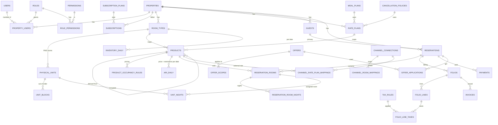

# OzePMS — Database (Phase 0)

The full table specification (columns, types, defaults, keys, indexes, constraints) is
`database/schema/ozepms_schema_v1.sql`. It has been loaded and tested on MySQL 8.
Laravel migrations will be generated from it phase by phase.

## Entity groups

| Group | Tables |
|---|---|
| Reference | currencies, countries, states, languages, property_types, bed_types |
| Platform | users, password_reset_tokens, login_attempts, permissions, roles, role_permissions, platform_user_roles, subscription_plans, subscriptions, audit_logs, system_error_events |
| Property | properties, property_users, property_settings, property_languages, property_age_bands, property_counters, content_translations |
| Accommodation | room_types, room_type_beds, room_type_images, physical_units, unit_blocks, amenities, property_amenities, room_type_amenities, physical_unit_amenities |
| Rates | meal_plans, cancellation_policies, cancellation_policy_rules, rate_plans, room_type_rate_plans (products), product_occupancy_rules |
| Daily ARI | inventory_daily, ari_daily, ari_daily_occupancy, ari_change_log |
| Reservations | booking_sources, guests, reservations, reservation_rooms, reservation_room_nights, unit_nights, reservation_guests, reservation_status_history |
| Tax | tax_categories, tax_rules, tax_rule_scopes |
| Offers | offers, offer_scopes, offer_conditions, offer_applications |
| Billing | services, folios, folio_lines, folio_line_taxes, payments, payment_gateway_events, invoices |
| Reporting | stats_daily |
| Channel (Phase 8) | channel_connections, channel_room_mappings, channel_rate_plan_mappings, channel_sync_logs, channel_reservations |

## Core ERD

(`PRODUCTS` = table `room_type_rate_plans`.)

## Data classes

| Class | Examples | Rule |
|---|---|---|
| Master | room_types, rate_plans, tax_rules, offers | editable, deactivated not deleted |
| Transaction | reservations, folio_lines, payments | append / status change, never hard-deleted |
| Snapshot | rate_snapshot, folio_line_taxes, invoices.snapshot, offer_applications.snapshot | frozen at time of booking/billing; later master edits never rewrite history |
| Derived / counters | inventory_daily.sold/held/ooo_units, reservations totals, stats_daily | maintained in the same transaction or by jobs; reconciled nightly |

## Index design → query

| Query | Index used |
|---|---|
| Availability for room types over dates | `inventory_daily` PK `(room_type_id, stay_date)` |
| Prices/restrictions for products over dates | `ari_daily` PK `(product_id, stay_date)` |
| Calendar month for whole property | `ix_inv_property_date`, `ix_ari_property_date` |
| Tape chart (PMS rooms × dates) | `unit_nights.ix_un_tapechart (property_id, stay_date)` |
| Arrivals / departures / in-house | `ix_res_arrivals`, `ix_res_departures`, `ix_rr_inhouse` |
| Reservation list (newest first, filtered) | `ix_res_created`, `ix_res_status`, `ix_res_payment`, `ix_res_source` + keyset |
| Booking reference | `uq_res_ref` |
| Guest search | `ix_guests_email`, `ix_guests_phone`, `ix_guests_phone_rev`, `ix_guests_name`, `ft_guests_name` |
| Revenue by business date | `folio_lines.ix_fl_revenue` |
| Hold expiry job | `ix_res_hold_expiry` |
| OTA delta sync | `ari_change_log.ix_acl_property (property_id, id)` |

## Volume estimate

| Table | Per property (20 room types, 3 manual products each, 2 years) | 2 000 properties |
|---|---|---|
| inventory_daily | 14 600 rows | 29 M |
| ari_daily | 43 800 rows | 88 M |
| unit_nights (100 rooms, 75% occupancy, 2 yrs) | 55 000 rows | 110 M |

Each row is ~40–60 bytes, so these sizes fit comfortably in InnoDB with the clustered keys above.
`stay_date` is part of every daily primary key, so the tables can be partitioned by year later without schema changes.

## Validation results (MySQL 8.0.46)

| Test | Result |
|---|---|
| Full schema load (71 tables) | OK |
| PMS room of property B pointing to room type of property A | rejected by composite FK |
| Atomic booking of the last 2 rooms | succeeded (2 rows) |
| Further booking when one night is full | guarded update touched fewer rows than nights → rollback |
| Direct overbooking write bypassing the service | rejected by CHECK `ck_inv_no_overbook` |
| Same PMS room twice on the same night | rejected by `unit_nights` primary key |
| Derived product without parent | rejected by CHECK `ck_prod_derived` |

## Phase 3 additions

| Migration | Change | Why |
|---|---|---|
| `2026_10_03_000002_add_max_advance_to_ari_daily` | `ari_daily.max_advance_days SMALLINT UNSIGNED NULL` | booking window per date: `cutoff_days` is the minimum days between booking and arrival, `max_advance_days` the maximum |

How the daily tables are maintained (code in `app/Domain/Inventory`):

* Rows exist from the property's today up to `config('ozepms.inventory.horizon_days')` (730) ahead.
  `inventory:horizon` (scheduled daily 00:30) and the Phase 2 events (room type / PMS rooms / product changed)
  create them with one `INSERT IGNORE … SELECT` over a generated date list. Existing rows are never overwritten.
  New `ari_daily` rows take the product's default price and the rate plan's default restrictions.
* `inventory_daily.total_units` = active PMS rooms; `ooo_units` = active rooms with an open block
  (out of order, maintenance, owner hold) that night. Both are recounted when rooms or blocks change,
  in the same statement, so the CHECK sees the final row.
* Every write to `sold`, `held`, `ooo_units` is a guarded `UPDATE` written with additions only
  (`LEAST(total_units, COALESCE(sell_limit, total_units)) >= ooo_units + sold + held + :rooms`), so unsigned
  columns never underflow and the CHECK `ck_inv_no_overbook` never has to fire.
* Calendar edits update only rows whose values really change (NULL-safe comparison), write one
  `ari_change_log` row per room type / product and scope, and increment `properties.ari_version` once.
* Cutoff = `ari_daily.cutoff_days` (minimum days between booking and arrival), shown and edited on the calendar
  as "Cutoff"; `max_advance_days` is the other end of the booking window. No further column was needed.
* "Copy values" (calendar) reads the source nights of `ari_daily` / `ari_daily_occupancy` by primary key range and
  writes the target nights through the same change sets as any calendar edit (`AriService::applyMany`: one
  transaction, one `ari_version` step); nights with equal values are grouped into one range (with a weekday
  filter when they form a weekly pattern), so a month copy is a handful of `UPDATE … WHERE product_id = ? AND
  stay_date BETWEEN ? AND ?` statements per rate plan.
* Year overview (`CalendarYearQuery`): three range reads for twelve months — `inventory_daily` and `ari_daily`
  on `(property_id, stay_date)` plus the small room type / product tables — aggregated in PHP to one level
  string and one lowest-price list per room type (the page never receives room type × rate plan × night cells).

### Retention / archival (spec §17)

`php artisan inventory:archive` (scheduled monthly, 1st at 01:30) deletes, per property and in batches of
`ozepms.inventory.archive_batch` (5 000) rows on the `(property_id, stay_date)` indexes:

| Table | Removed | Setting |
|---|---|---|
| `inventory_daily`, `ari_daily`, `ari_daily_occupancy` | nights before the property's today − retention | `ozepms.inventory.retention_days` (400, env `OZ_INVENTORY_RETENTION_DAYS`) |
| `ari_change_log` | rows created before now − log retention | `ozepms.inventory.change_log_retention_days` (400, env `OZ_ARI_LOG_RETENTION_DAYS`) |

Today and future nights are never touched (retention ≥ 1 day), and the cut-off never passes the first night of a
reservation that is still open (hold, pending, confirmed, checked in). Nothing references these rows by key:
reservations keep their nightly prices in `reservation_room_nights` and the rate snapshot, and reports use their
own daily rollups, so removing old nights loses no booking or statistic. Options: `--property=P1001`, `--days=`,
`--log-days=`, `--dry-run` (counts only). Keeping about 13 months lets "copy values" use the same period last year.

## Load test (Phase 3)

`php artisan inventory:benchmark --seed` on a separate database (`ozepms_perf`): 50 properties × 10 room types ×
4 rate plans (one derived) × 10 rooms × 730 days = 365 000 `inventory_daily` and 1 460 000 `ari_daily` rows.
Random property, arrival within the horizon, 1–3 adults, 0–1 child; 300 searches per stay length.
Container with 2 vCPUs, MySQL 8.0, PHP 8.3 CLI (no opcache), another workload running at the same time.

| Operation | p50 | p95 | p99 |
|---|---|---|---|
| `AvailabilityService::search`, 1 night | 21 ms | 30 ms | 35 ms |
| search, 3 nights | 25 ms | 38 ms | 41 ms |
| search, 7 nights | 41 ms | 67 ms | 72 ms |
| search, 14 nights | 57 ms | 94 ms | 112 ms |
| `InventoryService::reserve`, 3 nights | 4 ms | 7 ms | 10 ms |

Re-run 06 Oct 2026 after the calendar completion (same data, 300 searches per stay length, 100 calendar reads):

| Operation | p50 | p95 | p99 |
|---|---|---|---|
| search, 1 night | 20 ms | 30 ms | 34 ms |
| search, 3 nights | 26 ms | 38 ms | 42 ms |
| search, 7 nights | 42 ms | 67 ms | 77 ms |
| search, 14 nights | 55 ms | 92 ms | 112 ms |
| `InventoryService::reserve`, 3 nights | 3 ms | 7 ms | 14 ms |
| calendar month window (10 room types × 4 rate plans × 31 nights) | 16 ms | 35 ms | 44 ms |
| calendar year overview (10 room types × 4 rate plans × 365 nights) | 47 ms | 66 ms | 84 ms |

A search runs 8 queries whatever the stay length: room types, products, occupancy rules, rate plans (small
master tables), then the `inventory_daily`, `ari_daily` and `ari_daily_occupancy` ranges for the whole property
(`ix_inv_property_date`, `ix_ari_property_date`, `ix_ario_property_date`) and the age bands. The daily queries take
1–3 ms; the rest of the time is pricing and restriction checks in PHP for 40 products, which grows with the number
of nights. With opcache and JIT enabled the p95 figures are 25 / 36 / 61 / 89 ms.

## Phase 4 additions (reservations)

Migration `2026_10_04_000002_add_front_office_columns`:

| Change | Why / index |
|---|---|
| `guests.guest_no` (per-property number, `uq_guests_no`), `title`, `guest_type`, `tags` (JSON), `preferences`; `ix_guests_created` | Guest list "G-000001", filters, created-date range |
| `reservations.arrival_time`, `departure_time`, `purpose`, `market`, `travel_agent`, `company_name`, `channel_ref`, `updated_by`; `ix_res_rooms (property_id, room_count, check_in)`, `ix_res_checkin_date (property_id, check_in, check_out)` | Stay details on the form; "Group" tab; stay-date range filter |
| `reservation_rooms.public_id` (`uq_rr_public`) | Pages address a room (assign, check in) without internal ids |
| `notes` (`ix_notes_subject`) | Append-only notes on reservations and guests |
| `guest_documents` (`ix_gdoc_guest`, `ix_gdoc_res`) | Metadata of uploaded ID scans; files on the private disk |
| System rows in `booking_sources` | direct, walk_in, phone, email, booking_engine, ota, travel_agent, corporate |

Rules kept by `ReservationService`: `inventory_daily.sold` = number of active `reservation_room_nights` (drafts, cancelled and no-show rooms have inactive nights); `unit_nights` PK prevents double assignment of a PMS room; booking references `R-<year><seq>` and guest numbers come from `property_counters` (row locked until commit); `reservations.idempotency_key` (unique per property) makes a repeated create return the first booking.

## Phase 5 additions (offers & promotions)

* `offers` (Phase 0 table) + migration `2026_10_05_000002_add_offer_design_columns`: `offer_type` (room_discount, package, early_bird, last_minute, long_stay, other — list tabs, index `ix_offers_type`), `description`, `image_path`, and `discount_type` value `free_nights` (stay X pay Y: `min_nights` = X, `discount_value` = free nights per full block).
* Scope = `offer_scopes` rows (room type × rate plan; no rows = every room). Conditions = `offer_conditions` rows: `source` (in), `guest_country` (in / not_in), `min_adults`, `min_rooms` (gte).
* Status is derived, never stored: inactive (`is_active` = 0) → expired (stay or booking window over, or `redemptions` ≥ `max_redemptions`) → scheduled (`booking_from` after today) → active.
* One central engine, `App\Domain\Offers\OfferService::evaluate()`, used by the reservation pricing (`StayPricer`) for quotes, new and changed bookings; the booking engine will call the same method with channel `booking_engine`.
* Choice per room: a valid entered promo code first, then `priority`, then the bigger discount; more offers are added only while every applied offer `is_stackable`; each works on what is left of the night price. Discounts come before tax (taxes are worked out on the discounted night price).
* Frozen on the booking: `reservation_room_nights.discount` per night, `reservation_rooms.discount_total`, and `offer_applications` (one row per room and offer, `snapshot` = offer terms + nightly amounts + the code that was entered). Editing an offer later never changes existing bookings; editing a booking keeps the discounts of unchanged nights (a changed promo code re-works them).
* Redemptions: counted with one guarded `UPDATE … SET redemptions = redemptions + 1 WHERE redemptions < max_redemptions` inside the booking transaction (parallel bookings cannot exceed the limit); a cancelled booking gives its redemption back (`ReleaseOfferRedemptions` listener).
* Offers used by a booking are deactivated instead of deleted (history stays readable).

## Phase 6 additions (booking engine & API)

* No new booking tables: the public booking engine writes through `ReservationService::create()` (channel `booking_engine`, source `booking_engine`), so inventory guards, offers, taxes and folios are the same as in the PMS.
* Online advance payment: the booking is `pending` with `reservations.hold_expires_at` = now + `config('ozepms.booking_engine.hold_minutes')`; index `ix_res_hold_expiry (status, hold_expires_at)` serves `booking:expire-holds` (every 5 minutes) which cancels unpaid holds and frees the rooms; a verified payment confirms the booking and clears the hold.
* Settings: `property_settings` key `booking_engine` (`enabled`, `intro`, `terms`).
* Search results are cached per property, keyed by `properties.ari_version` and the latest `offers.updated_at`, so any calendar or offer change invalidates them at once.
* `api_keys` (migration `2026_10_06_000001`): `public_id`, `property_id`, `name`, `prefix` CHAR(12) UNIQUE (lookup), `key_hash` CHAR(64) (SHA-256 of the whole key — the key itself is never stored), `abilities` JSON, `last_used_at`, `last_used_ip`, `expires_at`, `revoked_at`, `created_by`. Max 20 active keys per property; `last_used_at` is written at most once a minute.

## Phase 7 additions (reports)

* Reports never aggregate the booking tables on screen: they read two rollups, rebuilt per property and date range by `App\Domain\Reports\ReportRollupService` (one transaction, `INSERT … SELECT`, ranges split into 120-day chunks).
  * `stats_daily` (approved schema): property × night × room type — `units_total`, `units_ooo` (from `inventory_daily`), `rooms_sold`, `room_revenue` (active nights, net of discounts, before tax), `arrivals` / `departures` / `cancellations` / `no_shows` (rooms by arrival or departure date).
  * `stats_daily_mix` (migration `2026_10_07_000002`): property × night × room type × rate plan × booking source — `rooms_sold`, `guests`, `room_revenue`, `discount`, `tax`; indexes by rate plan and by source for the rate plan / source reports.
* Kept current by the listener `Listeners/Reports/RefreshReportStats` after every booking event (create, modify — old and new dates —, cancel, no-show, check-in / out) and room block, and by the nightly `reports:refresh` (03:10: last 7 days + selling horizon; `--all` rebuilds every date). Demo seeding rebuilds everything.
* Definitions: rooms available = rooms − out of order; occupancy = sold ÷ available; ADR = room revenue ÷ sold; RevPAR = room revenue ÷ available.
* Booking-date reports (reservations, cancellations, no-shows, booking counts, pickup "as of N days ago") read `reservations` through `ix_res_created`, `ix_res_status`, `ix_res_source`, always bounded by property and ≤ `config('ozepms.reports.max_days')` (400), 50 rows a page, CSV ≤ 20 000 rows.
* Money actually charged and collected reads the ledger: `folio_lines` by business date (`ix_fl_revenue`; a voided charge counts on its date and its reversal on the void date, as in the folio), `folio_line_taxes` for the tax report, `payments` by `received_at` (`ix_pay_property_time`).
